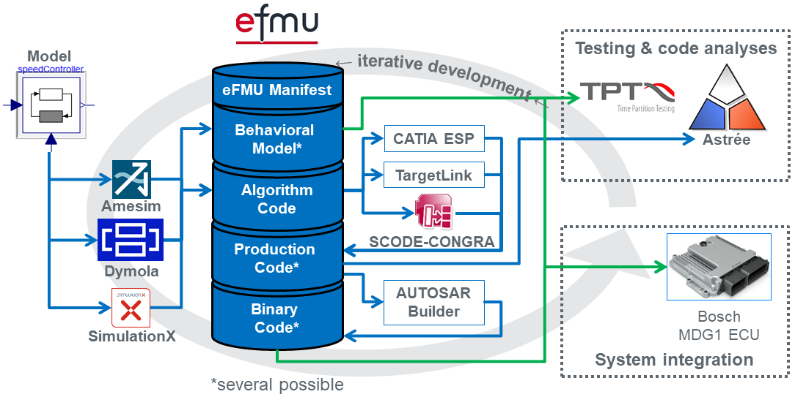

| [Introduction](../Introduction/index.md) | [News and events](.../News-and-events/index.md) | [_eFMI Standard_](../eFMI-Standard/index.md) | [Tools](../Tools/index.md) | [Resources](../Resources/index.md) | [FAQ](../FAQ/index.md) | [About](../About/index.md) |
| ---------------------------------------- | ----------------------------------------------- | -------------------------------------------- | -------------------------- | ---------------------------------- | ---------------------- | -------------------------- |

| [About eFMI](index.md) | [eFMI highlights](efmi-highlights.md) | [Project organization and community](project-organization-and-community.md) |
| ---------------------- | ------------------------------------- | --------------------------------------------------------------------------- |

> _"The eFMI Standard is an open standard for the step-wise, model-transformation-based development of advanced control functions suited for safety-critical and real time targets. Its container architecture defines the common ground for collaboration among the stake-holders and tooling along the various abstraction levels from high-level -- e.g., a-causal, equation-based physics -- modelling and simulation down to actual embedded code. The model representations it defines are interlinked for traceability and semi-automatic code generation and do not only capture functional, but also non-functional quality requirements like coding standards, static memory allocation, worst time execution and documentation, eventually enabling credible development within a standardized workspace."_ -- eFMI in three sentences.

# Objective

The main purpose of the _"[Modelica Association](https://modelica.org/) Project Functional Mock-up Interface for embedded systems"_ (MAP eFMI) is the development, standardization and promotion of the _eFMI Standard_. The _eFMI Standard_ is an open standard for step-wise development and validation of advanced control functions suited for safety-critical and real time targets. It enables the application of high-level abstraction and simulation models -- like a-causal physics models -- in embedded real-time and safety-critical software by providing a container architecture for the step-wise refinement of a first high-level algorithmic solution to an embedded implementation for some dedicated target environment.

# Container architecture and model representations

The _eFMI Standard_ can be thought of as a bridge closing the gap between the modelling and simulation world and the embedded software world. It defines a container architecture with various model representations to capture all activities of the required credible model transformation process:

- Behavior / reference results for testing (eFMI Behavioral Model containers).
- Target-independent algorithmic solution with guarantees on exception-free execution, error handling, worst time execution and memory requirements (eFMI Algorithm Code container) based on eFMI GALEC (_**G**_uarded _**A**_lgorithmic _**L**_anguage for _**E**_mbedded _**C**_ontrol).
- C implementations, tailored and optimized for the requirements of specific embedded execution environments (eFMI Production Code containers).
- Binary distributions and their build recipes, ready for embedded system integration (eFMI Binary Code containers).

# Collaborative workspaces (eFMUs)

Instances of the various eFMI container types -- each reflecting one aspect/step of the automatic transformation of some high-level model to an embedded solution -- are bundled in eFMUs (embedded Functional Mock-up Units). Each eFMU is one _shared/collaborative_ development workspace; shared hereby means that different stake-holders -- from simulation designers to embedded developers -- are working together using various eFMI tooling from different tool vendors to eventually implement the final embedded solution(s). The various containers of an eFMU reflect the development steps and intermediate artefacts that have been incrementally developed. Each used tool can be dedicated and shine on one abstraction and transformation level. The whole toolchain compatibility is ensured by the _eFMI Standard_ and its common means for cross-referencing and dependency tracking for traceability, hashing (checksums) for automatic stale-artefact analysis and copyright, licensing and description annotations for intellectual property protection and documentation.

# Workflow and tooling

The general eFMI workflow is sketched by the following figure, demonstrating actual eFMI prototype tooling that has been developed in the [EMPHYSIS](https://itea4.org/project/emphysis.html) research project [which finished February 2021](../About/history.md):

Starting point of every eFMI-based development project is the generation (or manual development) of an algorithmic, sampled input-output-block in eFMI GALEC, a new real time and safety-critical domain suited imperative language for the definition of mathematical algorithms. Given a GALEC program in an eFMI Algorithm Code container generated by some simulation tooling, further model transformations along the various eFMI abstraction levels down to actual embedded code can be conducted with respective eFMI tooling provided by third party tool vendors assuming they support the targeted embedded execution environment and hardware architecture (target platform).

In above example, the source is a physics model in [Modelica](https://modelica.org/modelicalanguage.html) and the final target a BOSCH MDG1 embedded control unit (ECU); the individual, mostly automatized development steps are:

* Generation of an algorithmic GALEC program from an a-causal physics-equations model in Modelica (eFMI Algorithm Code container generated with, e.g., Amesim, Dymola or SimulationX).
* Design and generation of reference test scenarios from simulations of the physics model (eFMI Behavioral Model containers generated with, e.g., Dymola).
* Generation of production codes from the algorithmic GALEC solution (eFMI Production Code containers generated with, e.g., CATIA ESP, TargetLink oder SCODE-CONGRA).
* Generation of executable binary codes from production codes (eFMI Binary Code containers for, e.g., the [AUTOSAR Adaptive Platform](https://www.autosar.org/) generated with, e.g., AUTOSAR Builder).
* Static program analyses and testing of production and binary codes with, e.g., Astrée and TPT, on a concrete target platform, e.g., BOSCH MDG1.

# Proof of the pudding

A
